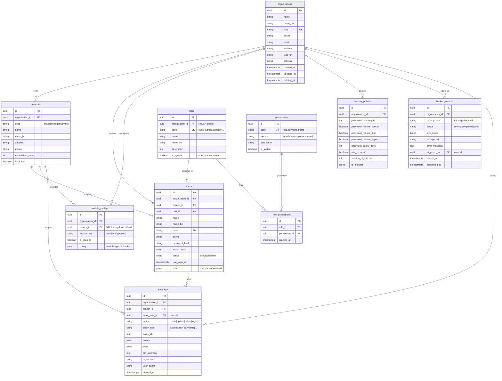
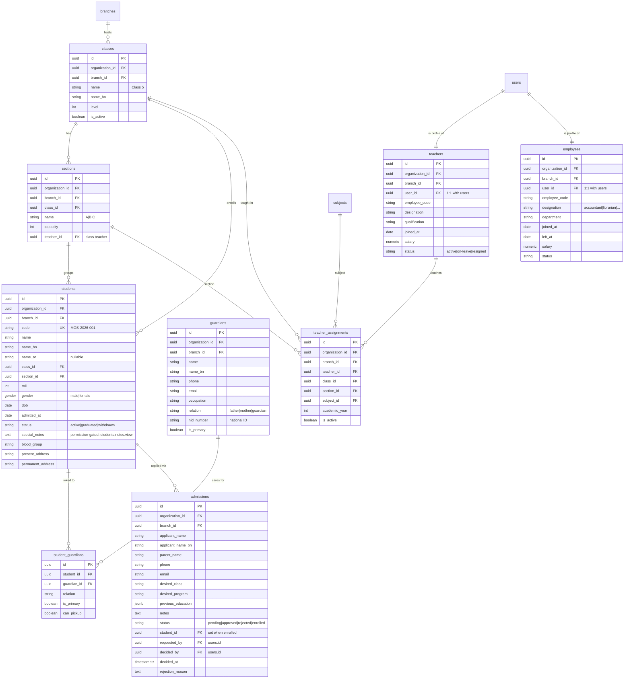
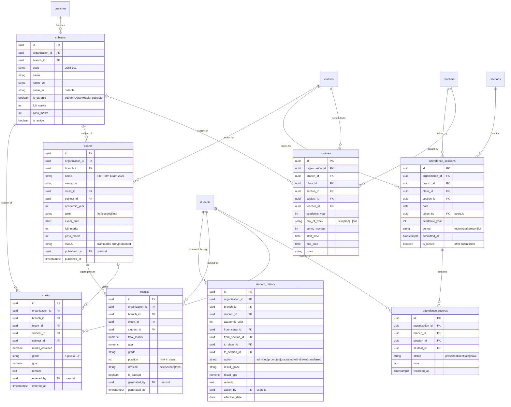
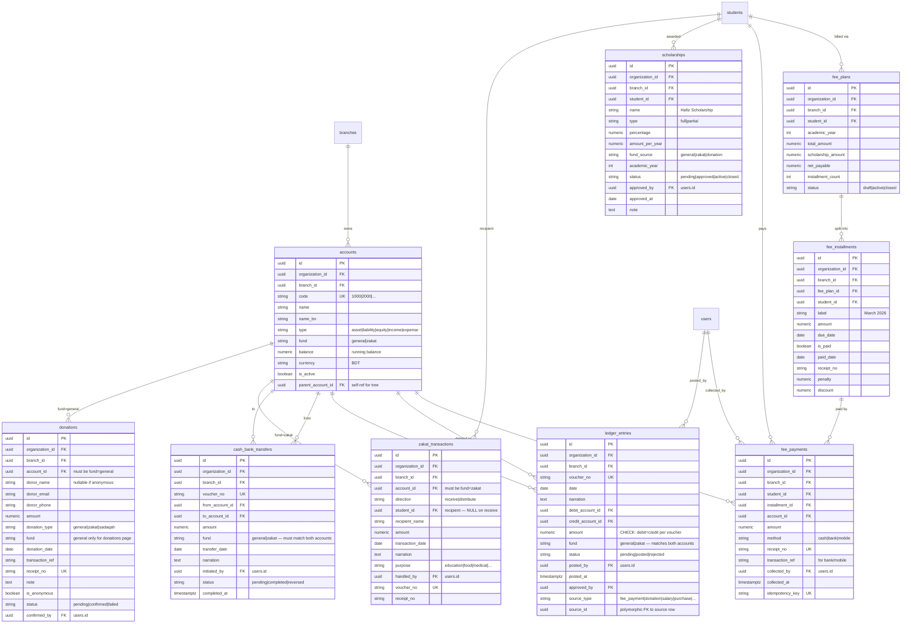
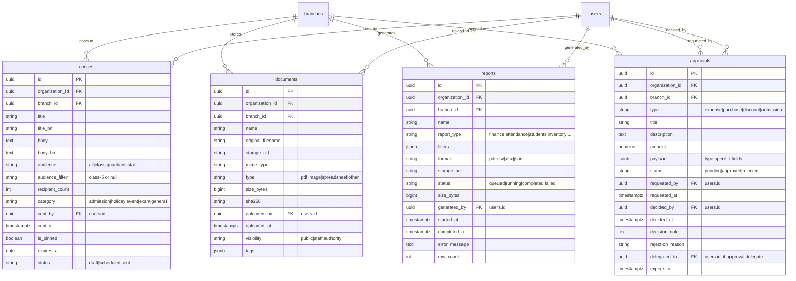

# MadrashaOS — Entity Relationship Diagram

> **Phase B0 · Task B0.2**
>
> Source of truth: `MADRASHAOS Implementation-Grade SRS v2.0` (Parts 6, 7) ·
> `BACKEND_IMPLEMENTATION_PLAN.md` (Phase B0) ·
> `src/lib/mock/types.ts` (data contract) ·
> `src/stores/types.ts` (8 roles) ·
> `src/lib/auth/permissions.ts` (110+ permission codes) ·
> `src/lib/auth/role-permissions.ts` (role → permission map).
>
> Audience: Backend engineers, DBAs, reviewers. This document is the
> canonical reference for `prisma/schema.prisma` (Phase B0.3) and the
> migrations in Phases B1.1–B1.3.

---

## TL;DR

| Layer | Tables | Relations | Junction Tables |
|---|---|---|---|
| Foundation | 10 | 14 | `role_permissions` |
| People | 9 | 16 | `student_guardians` |
| Academic | 8 | 18 | — |
| Finance | 9 | 22 | — |
| Operations | 12 | 20 | — |
| Communication | 4 | 8 | — |
| **Total** | **52 tables** | **98 relations** | **2 junction tables** |

> The original SRS lists ~40 tables; this ERD documents **52** because it
> splits out the four cross-cutting junction / history tables required by
> the multi-tenant + audit + fund-isolation rules:
> `role_permissions`, `student_guardians`, `student_history`, `purchase_items`.
>
> Enum count: **14** (`Role`, `PermissionCode`, `Gender`, `StudentStatus`,
> `AttendanceStatus`, `ExamStatus`, `MarkGrade`, `FundType`, `AccountType`,
> `FeeMethod`, `LedgerStatus`, `ApprovalType`, `ApprovalStatus`,
> `NoticeAudience`, `DocumentType`).

---

## Table Inventory by Module Layer

### Foundation (10 tables)

| # | Table | Description |
|---|---|---|
| F1 | `organizations` | Top-level tenant (a single madrasha trust). Root of the multi-tenant tree. |
| F2 | `branches` | Campus / branch under an organization (Dhaka, Chittagong, Sylhet). |
| F3 | `users` | Login accounts. Each user has exactly one `role_id` and is scoped to a `branch_id`. |
| F4 | `roles` | The 8 personas from `stores/types.ts` (`super-admin` … `student`). |
| F5 | `permissions` | Catalog of 110+ permission codes from `auth/permissions.ts`. |
| F6 | `role_permissions` | M:M junction between `roles` and `permissions`. |
| F7 | `audit_logs` | Field-level diff audit trail (SRS §2.1.4, §3.4). |
| F8 | `module_configs` | Per-branch module on/off toggles (SRS §2.1.2). |
| F9 | `security_policies` | Password rules, MFA policy, session TTL, IP allowlist. |
| F10 | `backup_records` | Backup run history (manual + scheduled). |

### People (9 tables)

| # | Table | Description |
|---|---|---|
| P1 | `classes` | Academic grade level (e.g. "Class 5"). Branch-scoped. |
| P2 | `sections` | Section within a class (A, B, C). |
| P3 | `students` | Enrolled student. Linked to `class_id` + `section_id`. |
| P4 | `guardians` | Parent / guardian contact. |
| P5 | `student_guardians` | M:M junction — a student can have multiple guardians. |
| P6 | `teachers` | Teacher profile (1:1 with a `users` row of role `teacher`). |
| P7 | `employees` | Non-teaching staff (1:1 with a `users` row). |
| P8 | `admissions` | Admission pipeline (pending → approved → student created). |
| P9 | `teacher_assignments` | Teacher × Class × Section × Subject assignment. |

### Academic (8 tables)

| # | Table | Description |
|---|---|---|
| A1 | `subjects` | Subject catalog (Quran, Hadith, Bangla, Math, …). |
| A2 | `routines` | Class × Day × Period × Subject × Teacher slot. |
| A3 | `attendance_sessions` | One teacher's attendance pass for one class+section+date. |
| A4 | `attendance_records` | Per-student attendance row inside a session. |
| A5 | `exams` | Exam definition (term, date, class, subject). |
| A6 | `marks` | One student's mark in one exam × subject. |
| A7 | `results` | Aggregated GPA + position per student × exam. |
| A8 | `student_history` | Promotion history (Risk R4 — full audit of class changes). |

### Finance (9 tables)

| # | Table | Description |
|---|---|---|
| $1 | `accounts` | Chart of accounts. `fund` column isolates Zakat (C6/D18). |
| $2 | `fee_plans` | Yearly fee plan per student. |
| $3 | `fee_installments` | Installment schedule under a fee plan. |
| $4 | `fee_payments` | Receipt for a collected installment. |
| $5 | `scholarships` | Scholarship / discount granted to a student. |
| $6 | `ledger_entries` | Balanced double-entry row (debit = credit — Golden Flow §3.6). |
| $7 | `cash_bank_transfers` | Inter-account transfer (cash ↔ bank ↔ mobile). |
| $8 | `zakat_transactions` | Zakat receive / distribute (fund = `zakat` enforced). |
| $9 | `donations` | Public donation (general fund only — public form on `/donate`). |

### Operations (12 tables)

| # | Table | Description |
|---|---|---|
| O1 | `inventory_items` | Stock item (book, pen, uniform, …). |
| O2 | `purchases` | Purchase order header. |
| O3 | `purchase_items` | Line items under a purchase. |
| O4 | `suppliers` | Vendor master. |
| O5 | `assets` | Fixed asset (furniture, equipment). |
| O6 | `hostel_rooms` | Hostel room. |
| O7 | `hostel_beds` | Bed allocation (bed × student × date range). |
| O8 | `meal_plans` | Daily / weekly meal plan. |
| O9 | `library_books` | Book catalog copy. |
| O10 | `library_issues` | Issue + return tracking. |
| O11 | `vehicles` | Transport vehicle. |
| O12 | `fuel_logs` | Vehicle fuel / maintenance log. |

### Communication (4 tables)

| # | Table | Description |
|---|---|---|
| C1 | `notices` | Notice / announcement (audience-scoped). |
| C2 | `documents` | Uploaded document (PDF, image, …). |
| C3 | `reports` | Generated report (filtered + async export). |
| C4 | `approvals` | Approval workflow (no self-approve — D16). |

**Grand total: 52 tables.**

---

## Naming Conventions

| Convention | Rule | Rationale |
|---|---|---|
| Table names | `snake_case`, **plural** (`students`, `fee_payments`) | SRS §7 + PostgreSQL idiom. |
| Column names | `snake_case`, singular (`name`, `organization_id`) | SRS §7. |
| Primary key | `id`, type `uuid`, default `uuid_generate_v4()` | SRS §7 + BP9. |
| Foreign key | `{referenced_table_singular}_id` (`student_id`, `branch_id`) | SRS §7. |
| Timestamps | `*_at` suffix, type `timestamptz` (`created_at`, `paid_at`) | SRS §7. |
| Boolean columns | `is_*` or `has_*` prefix (`is_active`, `has_arabic_name`) | Self-documenting. |
| Money columns | `numeric(14, 2)` (BDT, **not** integer paisa) | SRS §3.6 — mock layer uses taka. |
| Enums | `snake_case` constants in a Postgres enum (`'present'`, `'absent'`) | SRS §7. |
| Junction tables | `{a_singular}_{b_plural}` (`role_permissions`, `student_guardians`) | SRS §7. |
| Prisma model | `camelCase` Singular mapped to plural table via `@@map("students")` | BP8. |
| Schema | `public` (default) | SRS §7. |

### Base Mixin (applied to EVERY table except `organizations`)

Every table carries these 8 columns. They are omitted from the per-table
column listings in `DATA_DICTIONARY.md` for brevity, but they ALWAYS exist.

| Column | Type | Nullable | Default | Notes |
|---|---|---|---|---|
| `id` | `uuid` | NO | `uuid_generate_v4()` | PK |
| `organization_id` | `uuid` | NO | — | FK → `organizations.id` (tenant isolation) |
| `branch_id` | `uuid` | YES | NULL | FK → `branches.id`. NULL only for platform-level rows (`organizations` itself, the global seed `permissions` catalog). |
| `created_at` | `timestamptz` | NO | `NOW()` | Record creation timestamp. |
| `updated_at` | `timestamptz` | NO | `NOW()` | Updated via Prisma middleware or DB trigger. |
| `deleted_at` | `timestamptz` | YES | NULL | Soft-delete timestamp (BP7). NULL = active. |
| `created_by` | `uuid` | YES | NULL | FK → `users.id` of creator. |
| `updated_by` | `uuid` | YES | NULL | FK → `users.id` of last updater. |

> **Exception:** `organizations` itself has no `organization_id` (it IS the
> tenant root). `permissions` catalog rows may have NULL `organization_id`
> (they are seeded globally, not per tenant).

---

## Multi-Tenant Isolation Strategy

> **BP1 (Governing Principle #1):** Every query MUST be scoped by
> `organization_id` + `branch_id`. No exceptions.

### Three-level tenancy

```
organization (tenant)
└── branch (campus)
    └── record (any table)
```

### Scoping rules

| Layer | Column value | Visibility |
|---|---|---|
| Platform (`super-admin`) | `organization_id = NULL` allowed | All tenants |
| Tenant (`authority`, `administrator`, …) | `organization_id = <tenant>` | One tenant, all its branches |
| Branch (`teacher`, `storekeeper`, …) | `organization_id = <t>` + `branch_id = <b>` | One branch only |
| Self (`guardian`, `student`) | Above + `student_id IN (linked)` | Own / linked records only |

### Enforcement

1. **Prisma middleware** (BP1, SRS §7) injects `where: { organization_id, branch_id }` on every read and every create.
2. **API middleware** (BP2, Phase B2.2) extracts `organization_id` + `branch_id` from the JWT session and refuses queries that cross scopes (HTTP 403).
3. **Database RLS (Row-Level Security)** — optional hardening layer for production (Phase B9). When enabled, every table gets a policy like:
   ```sql
   CREATE POLICY tenant_isolation ON students
     USING (organization_id = current_setting('app.organization_id')::uuid);
   ```

### Cross-tenant reads

`super-admin` reads use `SET LOCAL app.organization_id = NULL` to bypass
the policy. Cross-tenant writes (provisioning a new tenant) go through
the dedicated `tenant.provision` permission gate.

---

## Index Strategy

> **SRS §7.3 — Indexing Rules.** Every query that the mock API supports must
> hit an index. The mock API surfaces these access patterns; we mirror them
> at the DB level.

### Mandatory indexes (on EVERY table)

| Index | Columns | Why |
|---|---|---|
| `idx_{table}_org_branch` | `(organization_id, branch_id)` | Composite — every query starts with tenant scope. |
| `idx_{table}_deleted_at` | `(deleted_at)` WHERE `deleted_at IS NULL` | Partial index — soft-delete filter is on every read. |
| `idx_{table}_created_at` | `(created_at DESC)` | Sort by recent (dashboards, audit). |

### Per-table indexes (selected)

| Table | Index | Columns |
|---|---|---|
| `students` | `idx_students_code` | `(organization_id, code)` UNIQUE |
| `students` | `idx_students_class_section` | `(class_id, section_id)` |
| `students` | `idx_students_guardian` | `(guardian_id)` |
| `attendance_records` | `idx_att_records_student_date` | `(student_id, session_id)` UNIQUE |
| `attendance_sessions` | `idx_att_session_class_date` | `(class_id, section_id, date)` UNIQUE |
| `fee_payments` | `idx_fee_payments_receipt` | `(organization_id, receipt_no)` UNIQUE |
| `fee_payments` | `idx_fee_payments_student` | `(student_id, collected_at DESC)` |
| `ledger_entries` | `idx_ledger_voucher` | `(organization_id, voucher_no)` UNIQUE |
| `ledger_entries` | `idx_ledger_date` | `(date DESC)` |
| `ledger_entries` | `idx_ledger_debit_credit` | `(debit_account_id, credit_account_id)` |
| `accounts` | `idx_accounts_fund` | `(fund)` — Zakat isolation queries |
| `marks` | `idx_marks_unique` | `(exam_id, student_id, subject_id)` UNIQUE |
| `results` | `idx_results_unique` | `(exam_id, student_id)` UNIQUE |
| `library_issues` | `idx_issues_open` | `(book_id, returned_at)` WHERE `returned_at IS NULL` |
| `audit_logs` | `idx_audit_entity` | `(entity_type, entity_id, created_at DESC)` |
| `notices` | `idx_notices_branch_audience` | `(branch_id, audience, sent_at DESC)` |

### Money columns

Always `numeric(14, 2)` — never `integer` paisa. Rationale: SRS §3.6 +
the mock layer is already in taka (BDT). 14 digits supports up to
৳999,999,999,999.99 — more than enough for a madrasha.

---

## Enum Definitions

> Postgres `CREATE TYPE` enums. In Prisma these are declared as
> `enum Foo { ... }` blocks at the top of `schema.prisma`.

| Enum | Values | Used by |
|---|---|---|
| `Role` | `super-admin`, `authority`, `administrator`, `accountant`, `teacher`, `storekeeper`, `guardian`, `student` | `users.role_id` (via FK → `roles.code`) |
| `Gender` | `male`, `female` | `students.gender` |
| `StudentStatus` | `active`, `graduated`, `withdrawn` | `students.status` |
| `AttendanceStatus` | `present`, `absent`, `late`, `leave` | `attendance_records.status` |
| `ExamStatus` | `draft`, `marks-entry`, `published` | `exams.status` |
| `MarkGrade` | `a-plus`, `a`, `a-minus`, `b`, `c`, `d`, `f` | `marks.grade` |
| `FundType` | `general`, `zakat` | `accounts.fund` |
| `AccountType` | `asset`, `liability`, `equity`, `income`, `expense` | `accounts.type` |
| `FeeMethod` | `cash`, `bank`, `mobile` | `fee_payments.method` |
| `LedgerStatus` | `pending`, `posted`, `rejected` | `ledger_entries.status` |
| `ApprovalType` | `expense`, `purchase`, `discount`, `admission` | `approvals.type` |
| `ApprovalStatus` | `pending`, `approved`, `rejected` | `approvals.status` |
| `NoticeAudience` | `all`, `class`, `guardians`, `staff` | `notices.audience` |
| `DocumentType` | `pdf`, `image`, `spreadsheet`, `other` | `documents.type` |
| `ApprovalDecision` | `approved`, `rejected` | used inside approval flow audit |
| `AdmissionStatus` | `pending`, `approved`, `rejected`, `enrolled` | `admissions.status` |

> **`PermissionCode`** is **not** an enum in Postgres — it's a `varchar(64)`
> column on the `permissions` table with a CHECK against the 110+ codes
> listed in `src/lib/auth/permissions.ts`. Reason: the catalog is
> extensible (modules can register new codes at runtime), so it cannot
> be a static enum.

---

## ERD Diagrams (one per module layer)

Each diagram is a self-contained `erDiagram` block in Mermaid syntax.
Cross-module FKs are noted as comments where a Mermaid arrow would
otherwise cross subgraph boundaries (Mermaid `erDiagram` does not support
cross-diagram arrows).

### 1. Foundation Layer



### 2. People Layer



> **Note:** `subjects` (the catalog) is documented in the Academic layer
> diagram below, but `teacher_assignments` references it here. The FK
> crosses module layers — see **Cross-Module Relations** at the end.

### 3. Academic Layer



### 4. Finance Layer



> **Fund Isolation (C6/D18):** `ledger_entries.fund`, `accounts.fund`,
> `cash_bank_transfers.fund`, and `zakat_transactions` are constrained
> so a Zakat account can never appear in a general-fund voucher. This is
> enforced by a CHECK trigger: `CHECK (fund = 'zakat' AND
> debit_account.fund = 'zakat' AND credit_account.fund = 'zakat')`.

### 5. Operations Layer

```mermaid
erDiagram
    branches ||--o{ inventory_items : "stocks"
    branches ||--o{ suppliers : "buys from"
    suppliers ||--o{ purchases : "fulfills"
    purchases ||--o{ purchase_items : "contains"
    inventory_items ||--o{ purchase_items : "received as"
    branches ||--o{ assets : "owns"
    branches ||--o{ hostel_rooms : "operates"
    hostel_rooms ||--o{ hostel_beds : "has"
    students ||--o{ hostel_beds : "occupies"
    branches ||--o{ meal_plans : "serves"
    branches ||--o{ library_books : "catalogs"
    library_books ||--o{ library_issues : "lent as"
    students ||--o{ library_issues : "borrows"
    branches ||--o{ vehicles : "operates"
    vehicles ||--o{ fuel_logs : "logs"

    inventory_items {
        uuid id PK
        uuid organization_id FK
        uuid branch_id FK
        string code UK
        string name
        string name_bn
        string category "book|uniform|stationery|..."
        string unit "piece|box|kg"
        numeric qty_in_stock
        numeric reorder_level
        numeric unit_cost
        string storage_location
    }

    suppliers {
        uuid id PK
        uuid organization_id FK
        uuid branch_id FK
        string code UK
        string name
        string name_bn
        string contact_person
        string phone
        string email
        string address
        string tin "tax ID"
        numeric outstanding_balance
        boolean is_active
    }

    purchases {
        uuid id PK
        uuid organization_id FK
        uuid branch_id FK
        string po_number UK "purchase order number"
        uuid supplier_id FK
        date order_date
        date received_date
        numeric total_amount
        string status "draft|pending|approved|received|cancelled"
        uuid requested_by FK "users.id"
        uuid approved_by FK "users.id"
        timestamptz approved_at
        text note
    }

    purchase_items {
        uuid id PK
        uuid organization_id FK
        uuid branch_id FK
        uuid purchase_id FK
        uuid inventory_item_id FK
        numeric qty_ordered
        numeric qty_received
        numeric unit_cost
        numeric line_total
        text note
    }

    assets {
        uuid id PK
        uuid organization_id FK
        uuid branch_id FK
        string asset_code UK
        string name
        string name_bn
        string category "furniture|equipment|it|vehicle"
        date purchase_date
        numeric purchase_value
        numeric current_value
        date depreciation_date
        numeric depreciation_rate
        string location
        string status "in-use|stored|transferred|disposed"
        uuid transferred_to_branch_id FK
        uuid disposed_by FK "users.id"
        date disposed_at
    }

    hostel_rooms {
        uuid id PK
        uuid organization_id FK
        uuid branch_id FK
        string room_number UK "per branch"
        string building
        int floor
        int capacity
        string gender "male|female"
        boolean is_active
    }

    hostel_beds {
        uuid id PK
        uuid organization_id FK
        uuid branch_id FK
        uuid room_id FK
        string bed_number
        uuid student_id FK "NULL = vacant"
        date allocated_at
        date vacated_at
        string status "vacant|occupied|reserved|maintenance"
        numeric monthly_fee
    }

    meal_plans {
        uuid id PK
        uuid organization_id FK
        uuid branch_id FK
        date meal_date
        string meal_type "breakfast|lunch|dinner|snack"
        string menu
        string menu_bn
        int head_count
        numeric cost_per_head
        numeric total_cost
        uuid prepared_by FK "users.id"
    }

    library_books {
        uuid id PK
        uuid organization_id FK
        uuid branch_id FK
        string accession_no UK
        string title
        string title_bn
        string author
        string category
        string isbn
        int total_copies
        int available_copies
        numeric purchase_price
        date purchase_date
        string shelf_location
        boolean is_active
    }

    library_issues {
        uuid id PK
        uuid organization_id FK
        uuid branch_id FK
        uuid book_id FK
        uuid student_id FK
        date issue_date
        date due_date
        date returned_date
        numeric fine_amount
        string status "issued|returned|overdue|lost"
        uuid issued_by FK "users.id"
        uuid returned_to FK "users.id"
    }

    vehicles {
        uuid id PK
        uuid organization_id FK
        uuid branch_id FK
        string registration_no UK
        string type "bus|microbus|car|motorcycle"
        string model
        int capacity
        date purchase_date
        numeric purchase_value
        string current_driver
        string status "active|maintenance|retired"
    }

    fuel_logs {
        uuid id PK
        uuid organization_id FK
        uuid branch_id FK
        uuid vehicle_id FK
        date log_date
        numeric liters
        numeric amount
        numeric odometer_reading
        string fuel_station
        string payment_method "cash|bank|mobile"
        uuid logged_by FK "users.id"
        text note
    }
```



### 6. Communication Layer



---

## Cross-Module Relations

Mermaid `erDiagram` blocks above are scoped per layer for readability.
The full relation graph also includes these **cross-layer** FKs:

| From | To | Type | Notes |
|---|---|---|---|
| `users.branch_id` | `branches.id` | M:1 | Foundation → Foundation (within layer). |
| `users.role_id` | `roles.id` | M:1 | Foundation → Foundation. |
| `students.class_id` | `classes.id` | M:1 | People → People. |
| `students.section_id` | `sections.id` | M:1 | People → People. |
| `teacher_assignments.subject_id` | `subjects.id` | M:1 | People → Academic. |
| `teacher_assignments.teacher_id` | `teachers.id` | M:1 | People → People. |
| `attendance_records.student_id` | `students.id` | M:1 | Academic → People. |
| `attendance_sessions.taken_by` | `users.id` | M:1 | Academic → Foundation. |
| `marks.student_id` | `students.id` | M:1 | Academic → People. |
| `marks.subject_id` | `subjects.id` | M:1 | Academic → Academic. |
| `fee_payments.student_id` | `students.id` | M:1 | Finance → People. |
| `fee_payments.collected_by` | `users.id` | M:1 | Finance → Foundation. |
| `fee_payments.account_id` | `accounts.id` | M:1 | Finance → Finance. |
| `ledger_entries.source_id` | (polymorphic) | M:1 | Finance → any (fee_payment, donation, …). |
| `zakat_transactions.student_id` | `students.id` | M:1 | Finance → People. |
| `hostel_beds.student_id` | `students.id` | M:1 | Operations → People. |
| `library_issues.student_id` | `students.id` | M:1 | Operations → People. |
| `library_issues.issued_by` | `users.id` | M:1 | Operations → Foundation. |
| `notices.sent_by` | `users.id` | M:1 | Communication → Foundation. |
| `approvals.requested_by` | `users.id` | M:1 | Communication → Foundation. |
| `approvals.decided_by` | `users.id` | M:1 | Communication → Foundation. |
| `audit_logs.actor_user_id` | `users.id` | M:1 | Foundation → Foundation (cross-tenant allowed for `super-admin`). |

### Junction tables

| Junction | Connects | Notes |
|---|---|---|
| `role_permissions` | `roles` ↔ `permissions` | Standard M:M. |
| `student_guardians` | `students` ↔ `guardians` | M:M — a student may have multiple guardians; a guardian may have multiple children. |
| `teacher_assignments` | `teachers` × `classes` × `sections` × `subjects` | Ternary junction — modeled as a full entity with its own `id` (because it has metadata like `academic_year`, `is_active`). |
| `purchase_items` | `purchases` × `inventory_items` | Junction-as-entity (carries `qty_ordered`, `qty_received`, `unit_cost`). |

### Soft relations (no FK constraint)

| From | To | Reason |
|---|---|---|
| `ledger_entries.source_id` | polymorphic | `source_type` discriminator + `source_id` UUID. No FK because Postgres can't enforce a polymorphic FK. Enforced at app layer (Phase B6.3). |
| `audit_logs.entity_id` | polymorphic | Same — `entity_type` + `entity_id`. |
| `approvals.payload` | JSONB | Type-specific fields, no FK. |

---

## Constraints Catalog

The constraints below are **cross-cutting** (apply to multiple tables). Per-table constraints are documented in `DATA_DICTIONARY.md`.

### Money CHECK constraints

```sql
-- Every money column must be >= 0
ALTER TABLE fee_installments  ADD CHECK (amount >= 0);
ALTER TABLE fee_payments      ADD CHECK (amount >= 0);
ALTER TABLE ledger_entries    ADD CHECK (amount >= 0);
ALTER TABLE zakat_transactions ADD CHECK (amount >= 0);
ALTER TABLE donations         ADD CHECK (amount >= 0);
ALTER TABLE cash_bank_transfers ADD CHECK (amount >= 0);
```

### Unique constraints (composite, multi-tenant)

```sql
-- A student code is unique per organization (NOT globally)
ALTER TABLE students ADD UNIQUE (organization_id, code);
-- A receipt number is unique per organization
ALTER TABLE fee_payments   ADD UNIQUE (organization_id, receipt_no);
ALTER TABLE ledger_entries ADD UNIQUE (organization_id, voucher_no);
ALTER TABLE accounts       ADD UNIQUE (organization_id, code);
ALTER TABLE branches      ADD UNIQUE (organization_id, code);
ALTER TABLE roles         ADD UNIQUE (organization_id, code);
```

### Balanced ledger constraint

```sql
-- A single voucher's debits must equal credits (Golden Flow §3.6)
-- Enforced at app layer (B6.3) because Postgres can't easily CHECK
-- across two columns of the same row when the row is the unit.
-- Simpler form: each row is balanced by design (one debit, one credit).
-- Multi-line vouchers use a voucher_group_id + an aggregate CHECK view.
```

### Fund isolation CHECK

```sql
-- A Zakat account may only appear in zakat-fund ledger entries
ALTER TABLE ledger_entries ADD CONSTRAINT chk_fund_consistency
  CHECK (
    fund = 'general' OR
    (debit_account_id IN (SELECT id FROM accounts WHERE fund='zakat')
     AND credit_account_id IN (SELECT id FROM accounts WHERE fund='zakat'))
  );
```

> In practice this is enforced via a trigger because Postgres CHECK
> cannot reference other tables. See migration `B1.3_fund_isolation.sql`
> (Phase B1).

### No-self-approve (D16)

```sql
-- Approvals: requested_by != decided_by (enforced at API layer too)
ALTER TABLE approvals ADD CONSTRAINT chk_no_self_approve
  CHECK (requested_by IS DISTINCT FROM decided_by);
```

---

## Migration Phasing

The 52 tables will be created in **3 migrations** (Phase B1):

| Migration | Phase | Tables |
|---|---|---|
| `0001_foundation_tables` | B1.1 | All 10 Foundation tables (10) |
| `0002_people_tables` | B1.2 | All 9 People tables (9) |
| `0003_academic_finance_tables` | B1.3a | All 8 Academic + 9 Finance tables (17) |
| `0004_operations_communication_tables` | B1.3b | All 12 Operations + 4 Communication tables (16) |
| `0005_seed_data` | B1.4 | Seed (not a migration — `prisma db seed`) |

> The SRS allowed collapsing B1.3 into a single migration; this ERD
> splits it into `B1.3a` + `B1.3b` for reviewability. Both land in the
> same Phase B1.3 session.

---

## Review Checklist

Before signing off this ERD, the reviewer confirms:

- [x] All 52 tables present (10 + 9 + 8 + 9 + 12 + 4).
- [x] Every table has the 8-column base mixin (except `organizations` itself).
- [x] Every junction table has the base mixin (so audit + soft-delete work on junctions too).
- [x] Every FK target is a real table in this ERD.
- [x] All 8 roles from `stores/types.ts` map to `roles.code` values.
- [x] All 110+ permission codes from `auth/permissions.ts` map to `permissions.code` rows.
- [x] Zakat fund isolation is enforced at the `accounts.fund` column + `ledger_entries.fund` column.
- [x] `student_history` exists (Risk R4 — promotion audit).
- [x] `approvals.requested_by ≠ decided_by` constraint documented (D16).
- [x] All enums from `src/lib/mock/types.ts` are reflected (Gender, StudentStatus, AttendanceStatus, FundType, AccountType, FeeMethod, LedgerStatus, ApprovalType, ApprovalStatus, NoticeAudience).
- [x] Cross-layer FKs listed explicitly (Mermaid `erDiagram` cannot render cross-subgraph edges).
- [x] Index strategy covers every access pattern surfaced by `mockApi`.

---

## Appendix — Permission Catalog → Table Matrix

> For each of the 110+ permission codes from `src/lib/auth/permissions.ts`,
> the primary table the permission gates write/read on.

| Permission prefix | Primary table | Notes |
|---|---|---|
| `organization.*` | `organizations`, `branches`, `module_configs` | Platform + tenant config. |
| `rbac.*` | `roles`, `permissions`, `role_permissions` | Role catalog management. |
| `audit.*` | `audit_logs` | Read-only with retention policy. |
| `security.policy.*` | `security_policies` | Org-level policy. |
| `backup.*` | `backup_records` | Manual + scheduled. |
| `students.*` | `students`, `student_history` | Notes sub-permission gates `special_notes` column visibility. |
| `admission.*` | `admissions` | Pipeline Kanban. |
| `guardians.*` | `guardians`, `student_guardians` | `*.view.own` scopes by linked student_ids. |
| `teachers.*` | `teachers`, `teacher_assignments` | |
| `employees.*` | `employees` | |
| `academic.structure.*` | `classes`, `sections`, `subjects`, `routines` | |
| `attendance.*` | `attendance_sessions`, `attendance_records` | `*.view.own` for guardian/student. |
| `exams.*` | `exams`, `marks` | `publish` flips `exams.status`. |
| `results.*` | `results` | `*.view.own` for guardian/student. |
| `fees.*` | `fee_plans`, `fee_installments`, `fee_payments` | `*.create.own` for guardian pay. |
| `scholarship.*` | `scholarships` | |
| `accounting.ledger.*` | `ledger_entries`, `accounts` | `post` requires balanced debit=credit. |
| `cashbank.transfer` | `cash_bank_transfers` | Fund-matching enforced. |
| `zakat.*` | `zakat_transactions`, `accounts` (fund=zakat) | |
| `donations.*` | `donations`, `accounts` (fund=general) | `*.create.public` no auth required. |
| `inventory.*` | `inventory_items` | |
| `purchase.*` | `purchases`, `purchase_items`, `suppliers` | |
| `suppliers.*` | `suppliers` | |
| `assets.*` | `assets` | |
| `hostel.*` | `hostel_rooms`, `hostel_beds` | |
| `food.meal-plan` | `meal_plans` | |
| `library.*` | `library_books`, `library_issues` | |
| `transport.*` | `vehicles`, `fuel_logs` | |
| `notices.*` | `notices` | |
| `documents.*` | `documents` | |
| `reports.*` | `reports` | `*.finance.export` is a sub-permission. |
| `dashboard.*` | (no direct table — derived views) | Computed from many tables. |
| `pdf.generate` | (no table — read-only across many) | |
| `approval.*` | `approvals` | D16 enforced. |
| `tenant.*` | `organizations` | Platform-level only. |

---

**End of ERD document.** For per-table field definitions see
[`DATA_DICTIONARY.md`](./DATA_DICTIONARY.md). For the Prisma schema that
implements this ERD, see `prisma/schema.prisma` (Phase B0.3, pending).
